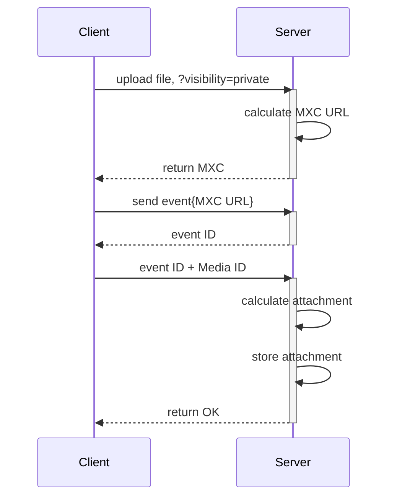
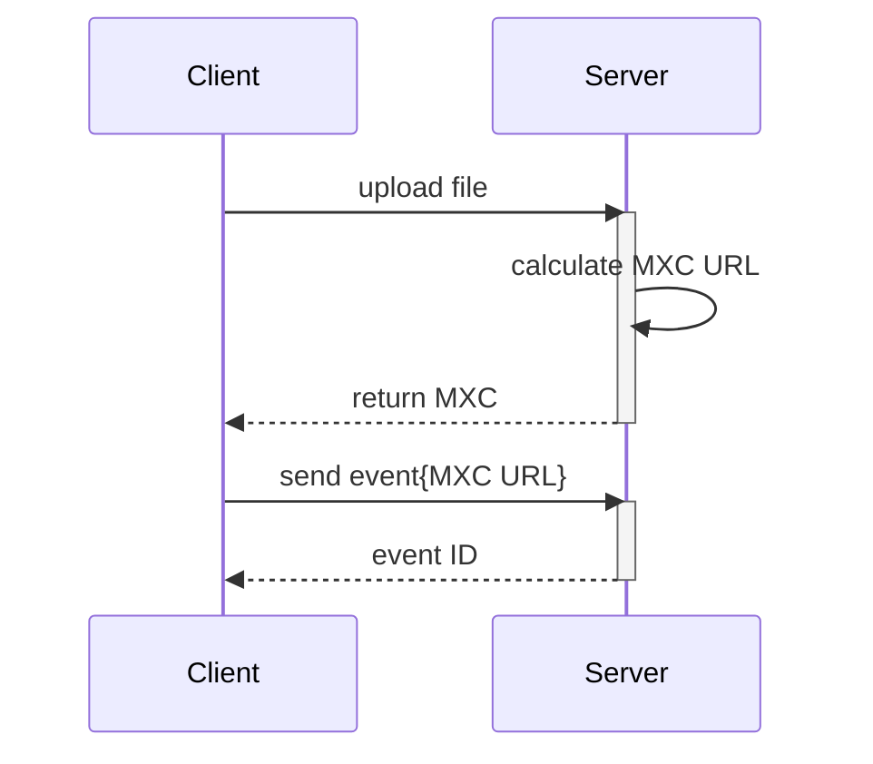
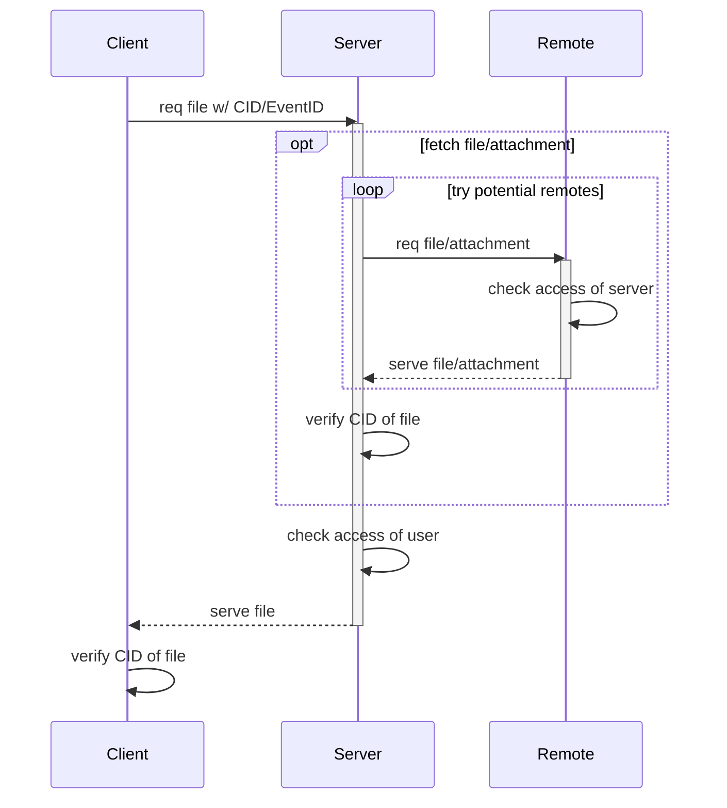

# MSCNaN: Authentication of Media through Event-Based Attachments
<sup>Authored by Jan Christian Grünhage and Andrew Morgan</sup>

Currently when a file is uploaded to a homeserver, a MXC URL is created
that allows anyone that possesses it to access that file - even if they do
not have an account on that, or any other homeserver. In practice we often
get around this limitation by sharing files in encrypted rooms - where clients
will automatically encrypt files before uploading them. However, there are many
cases where you may want to share private files in non-encrypted room.

This MSC aims to address authentication of media by linking it and the event
that is sent in the room when the media is shared. With this link, homeservers
can verify whether a user requesting a file has access to view an event, and
thus the ability to access the uploaded media.

## Proposal

### The Attachment

For controlling access to files we reuse event access, attaching event IDs
and room IDs to files. These attachments are represented by a json blob,
signed by the signing key of the server:
```json
{
  "event_id": "$854tBUEGeaXZOts1uV4E1gC0VfpAPaU4Z1gLEhXZyK4",
  "room_id": "!abcdefghijk:example.com",
  "proof": "multihash(room_id + event_id + file)"
}
```

Instead of attaching an event, a file can also be set to be public. For this,
the following simpler attachment structure is required:

```json
{
  "proof": "multihash('public' + file)"
}
```

The possible keys of an attachment are:

| name | type | description |
| :--- | :--: | :---------- |
| event_id | string | The ID of an event to attach to this file. |
| room_id | string | The ID of the room the event was sent in. <br/>This field is currently required while event IDs are not globally unique. |
| proof | string | A [multihash](https://multiformats.io/multihash/) of the file's contents and either the room ID concatanated with <br/>the event ID or the string 'public'. This ensures that only someone with access <br/>to the file content can then allow others to access the file.

. o O ( We could just let the client calculate the proof and let them upload
that instead of using the nonce and calculating that on the server, but then
we wouldn't have any indication that the file has a pending event ID
attachment. Maybe we can do another hash thing here, telling the server "hey
I'm about to use this file" with generating a hash of that file with some
predefined string and a current timestamp )

### Uploading:

Uploading a private file:



Uploading a public file:



#### The `visibility` query parameter

A new query parameter is added to the `POST /_matrix/media/r0/upload` endpoint called
`visibility`, due to the phrase being commonly used to assert access to an
entity across the Matrix spec. There are two possible values for this parameter:

* `private` - the uploaded file is intended to be private and an attachment must
  be uploaded separately before this file can be accessed.
* `public` - the uploaded file can be accessed by anybody who has the MXC URL.

The default is `public`, for backwards compatibility purposes.

#### Adding a new endpoint for uploading attachments

A new endpoint is added for media: `POST /_matrix/media/r0/attachment`.

TODO(word better): This is where we upload attachments. Not necessary for public
uploads, once this is done other users can access the file if they provide the
correct details etc. etc.

Merging the attachment to the media during the sending of the event itself
was considered, which would bring the event sending and media APIs closer
together. However, it would make things difficult for stand-alone media
repositories such as
[matrix-media-repo](https://github.com/turt2live/matrix-media-repo), as it
would require further communication between the media repository and
homeserver to be specified.

## Example

The client uploads a file, specifying whether the file should be private. If
the file is not set to private explicitly, it defaults to being public for
backwards compatibility reasons.

```
POST /_matrix/media/r0/upload?filename=something.png&visibility=private
Content-Type: image/png

<bytes>
```

The reply is made up of:

```json
{
  "content_uri": "mxc://example.org/abdefg123",
  "nonce": "abcde"
}
```

Once the file is stored on the server, the client sends an event into the
room. This could be a `m.file`, `m.audio`, `m.video` etc.

After sending the event and receiving an event ID, the client needs to attach
that event ID to the uploaded file. To do this, a request to the new `attach`
endpoint is made:

```
POST /_matrix/media/r0/attach?event_id=<event_id>&nonce=abcde
```

This calculates an attachment and stores it, while invalidating the nonce.

As an alternative to the nonce, clients can also calculate the attachment
themselves and upload it using the same endpoint:

```
POST /_matrix/media/r0/attach
Content-Type: application/json

{
  "event": "$854tBUEGeaXZOts1uV4E1gC0VfpAPaU4Z1gLEhXZyK4",
  "content": "bafkreibme22gw2h7y2h7tg2fhqotaqjucnbc24deqo72b6mkl2egezxhvy",
  "proof": "multihash(event_id + file)"
}
```

When no event_id is specified in the query parameters and no json body is passed, but the nonce is valid, mark the event public.

Note: Should we even provide the nonce way to send attachments?


#### Downloading:
This is limited to the "all good" case for private files. Things like public files, and denied access are left out to make the diagram more readable.



Potential remotes here starts with the server sending the event, continuing with servers that have been in the room when the event was sent, continuing with servers in the room right now.

In the case that the origin server in the `mxc` url responds, but doesn't have the file, try to fall back to the old download endpoint, in case this is a not a new style file. Server implementations are encouraged to serve old style files on the new endpoint too, in case the media ID that is sent over does match an old style file but not a new style one.

For future reference: In case of a public file, also try fetching it from IPFS, if directly fetching it fails.

#### Extending `GET /_matrix/media/r0/attachments`

TODO(verify): We allow clients and servers to request attachments of media files. This
is most useful for servers, as they will be able to create and save the
attachments for private files, meaning future requests for that file will not
require contacting the original server for verification again.

#### Example:

Let's say a client is trying to access a private event that's not available on the client's own homeserver, and needs to be fetched from a remote homeserver.

The client receives an event containing MXC URL (`mxc://example.org/bafkreibme22gw2h7y2h7tg2fhqotaqjucnbc24deqo72b6mkl2egezxhvy`). The client requests the file via the media download endpoint, providing the optional `event_id` query parameter: `/_matrix/media/r0/download/example.com/bafkreibme22gw2h7y2h7tg2fhqotaqjucnbc24deqo72b6mkl2egezxhvy?event_id=%24abcdef&allow_remote=true`.

The client's server determines whether this is a new MXC URL by attempting to decode the content ID. Upon success, it will retrieve the file either locally or from a remote server if necessary. The endpoint for retrieving the file from a remote is the same as the one the client called, but with the `allow_remote` option set to `false`.

If the server does not have the media locally, it will ask each homeserver in the room linked to the given event ID whether it has the file. If one does, the remote homeserver will check whether the requested content has an event attached to it. If it does, the remote checks that the client's server has a user in the room with that event. If it does, the remote returns the file and attachment.

The client's server then verifies the payload from the remote. It verifies file's integrity using the CID provided by the client. It then uses the attachment to ensure that this user is in the room and has access to the referenced event.

Assuming it does, the server happily serves the file, and caches it locally for others to retrieve in future.