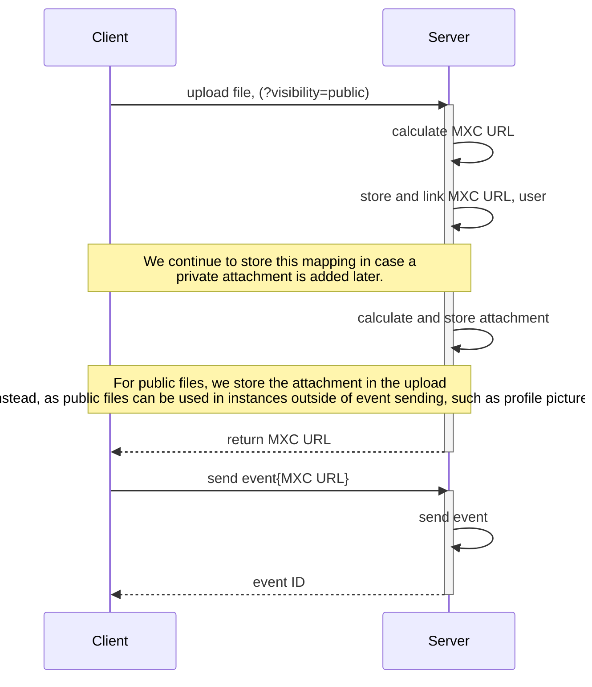

# MSCNaN: Authentication of Media through Event-Based Attachments
<sup>Authored by Andrew Morgan and Jan Christian Grünhage</sup>

Currently when a file is uploaded to a homeserver, a MXC URL is created
that allows anyone that possesses it to access that file - even if they do
not have an account on that, or any other homeserver. In practice we often
get around this limitation by sharing files in encrypted rooms - where clients
will automatically encrypt files before uploading them. However, there are many
cases where you may want to share private files in non-encrypted room.

This MSC aims to address authentication of media by linking it and the event
that is sent in the room when the media is shared. With this link, homeservers
can verify whether a user requesting a file has access to view an event, and
thus the ability to access the uploaded media.

TODO: Useful for pruning media. As once we know where media is useed, we can use
that to remove media that's no longer attached to an event or used anywhere else
meaningful.

TODO: Useful to delete media when an event is deleted.

## Proposal

### The Attachment

For controlling access to files we reuse event access, attaching event IDs
and room IDs to files. This is the function of attachments. Attachments are
represented by a json blob:
```json
{
  "event_id": "$854tBUEGeaXZOts1uV4E1gC0VfpAPaU4Z1gLEhXZyK4",
  "room_id": "!abcdefghijk:example.com",
  "proof": "multihash(room_id + event_id + file)"
}
```

Instead of attaching an event, a file can also be set to be public. For this,
the following simpler attachment structure is required:

```json
{
  "proof": "multihash('public' + file)"
}
```

An attachment is still required for public files in order to prove ...?

The possible keys of an attachment are:

| name | type | description |
| :--- | :--: | :---------- |
| event_id | string | The ID of an event to attach to this file. |
| room_id | string | The ID of the room the event was sent in. <br/>This field is currently required while event IDs are not globally unique. |
| proof | string | A [multihash](https://multiformats.io/multihash/) of the file's contents and either the room ID concatanated with <br/>the event ID or the string 'public'. This ensures that only someone with access <br/>to the file content can then allow others to access the file.

### Uploading:

#### Private Media


To upload access-controlled media:

1. The client uploads media, sigalling to the server that the media is private,
   and should only be accessible by users that can also read the associated
   event. An example request would look like:
   
   ```
   POST /_matrix/media/r0/upload?visibility=private
   Content-Type: application/pdf

   <bytes>
   ```
   
   The only addition this MSC makes is the `visibility` query parameter. The
   associated event will be sent shortly.
2. The server will calculate an MXC URL in the same way it does today.
3. The server will store an association between the user and the uploaded MXC
   URL. This allows the server to link the media upload and event sending
   requests together.
4. The server will return the MXC URL to the client.
5. Upon receiving the MXC URL, the client will insert it into the event it is
   intending to send. This can be a `m.room.message` with a media-related
   msgtype, or even an `m.room.membership` if the user is setting a profile
   picture that is private to a room.
6. The client will send the event and the MXC URL separately to the server.
   The separation is for two reasons. It is easier than requiring the server to
   fish the MXC URL out of the event, and that the server cannot read encrypted
   events. Sending the MXC URL outside of the event is implemented using another
   new query parameter on an existing endpoint: `mxc_uri`. For example:

   ```
   PUT /_matrix/client/r0/rooms/{roomId}/send/{eventType}/{txnId}?mxc_uri=mxc://example.com/abcde
   
   <event content>
   ```
7. The server will check whether an association exists between the provided
   MXC URL and the user making the request. If one does not, then fail the
   request, as we cannot verify that this user has had access to the file.
8. The server will create and store a private attachment using the event ID,
   room ID and the file's contents, similar to the following:

   ```json
   {
     "event_id": "$854tBUEGeaXZOts1uV4E1gC0VfpAPaU4Z1gLEhXZyK4",
     "room_id": "!abcdefghijk:example.com",
     "proof": "<multihash>"
   }
   ```
9. The server will then send the event containing the MXC URL to all remote
   servers in the room.

#### Public Media



To upload public media, the process is much the same as before other than a
small change on the server.

1. The client uploads media, sigalling to the server that the media is
   public, and is accessible to anyone who knows the media identifier. An
   example request would look like:
   
   ```
   POST /_matrix/media/r0/upload?visibility=public
   Content-Type: application/pdf

   <bytes>
   ```
   
   Again the `visibility` parameter is used and set to "public". The
   parameter may also be omitted, as "public" is default.
2. The server will calculate an MXC URL in the same way it does today.
3. The server will store and link the user and the MXC URL. While this is not
   necessary to send a public file, if the user wishes to make the file private
   later, then this mapping will be necessary.
   
   Note that this MSC does not currently provide an endpoint to make an
   existing public file private, which simply means adding a private
   attachment in addition to a file's existing public attachment. In this
   case, the server would still continue serve the file without
   authentication. However, the server would also approve authenticated
   attempts to access the file, and deny authenticated attempts that are
   invalid.
4. The server will calculate and store a public attachment for this file.
   This merely uses a multihash of the string "public" and the file's content.
   For example:
   ```json
   {
     "proof": "multihash('public' + file)"
   }
   ```

   Note that this step is completed during the uploading of the media, rather
   than when sending the event as in the authenticated media upload case. While
   this does introduce a minor increase in implementation complexity, the reason
   is that the send event step is not strictly necessary when uploading a public
   file. One could just take the returned MXC URL and do something else with it.
5. The server will return the generated MXC URL to the client.
6. The client now decides it wants to send this MXC URL leading to public
   media as part of an event. This works exactly the same way as before. For
   example:

   ```
   PUT /_matrix/client/r0/rooms/{roomId}/send/{eventType}/{txnId}
   
   <event content>
   ```
7. The server will then send the event containing the MXC URL to all remote
   servers in the room.

#### The `visibility` query parameter

A new query parameter is added to the `POST /_matrix/media/r0/upload` endpoint called
`visibility`, due to the phrase being commonly used to assert access to an
entity across the Matrix specification. There are two possible values for this parameter:

* `private` - the uploaded file is intended to be private and an attachment must
  be uploaded separately before this file can be accessed.
* `public` - the uploaded file can be accessed by anybody who has the MXC URL.

The default is `public`, for backwards compatibility purposes.

#### Downloading
Note that the diagram is limited to the "all good" case for authenticated media.
Things like public media, and denied access are left out to make the diagram
more legible.


1. The client requests a piece of authenticated media from its homeserver,
   providing an event ID to help prove the user's access. This is done via a new
   `event_id` parameter. An example request would look like the following:

   ```
   GET /_matrix/media/r0/download/example.org/1220...89a8?event_id=public
   ```


TODO: Note that the server MUST verify that the user has access to the event_id
specified with the MXC URL, and that an attachment exists proving the this
event_id/room_id combo and MXC URL are linked.

The process for implementations selecting potential remotes SHOULD be the following:

1. Try the server encoded in the MXC URL.
2. Try the servers that used to be in the room back then and still are.
3. Try the servers that are in the room now but weren't back then.
4. Try the servers that used to be in the room but aren't anymore. These are
    tried last to make sure servers leaving a room aren't put under any
    unnecessary load from that room anymore.

#### The `event_id` query parameter

A new query parameter is added to the `GET /_matrix/media/r0/download`
endpoint called `event_id`. This allows the client to signal to the server
which event ID it found the MXC URL in, and that it would like to
authenticate using the user's access to the event ID and an associated
attachment.

#### Extending `GET /_matrix/media/r0/attachments` (TODO: /attachment?)

TODO(verify): We allow clients and servers to request attachments of media
files. This is most useful for servers, as they will be able to save the
attachments for private files, meaning future requests for that file will not
require contacting the original server for verification again.

(Wait but won't we request the attachment anyways when requesting media? Or do
we want this to be two separate requests? Why would it ever be separate?)

#### Example:

Let's say a client is trying to access a private event that's not available on the client's own homeserver, and needs to be fetched from a remote homeserver.

The client receives an event containing MXC URL (`mxc://example.org/bafkreibme22gw2h7y2h7tg2fhqotaqjucnbc24deqo72b6mkl2egezxhvy`). The client requests the file via the media download endpoint, providing the optional `event_id` query parameter: `/_matrix/media/r0/download/example.com/bafkreibme22gw2h7y2h7tg2fhqotaqjucnbc24deqo72b6mkl2egezxhvy?event_id=%24abcdef&allow_remote=true`.

The client's server determines whether this is a new MXC URL by attempting to decode the content ID. Upon success, it will retrieve the file either locally or from a remote server if necessary. The endpoint for retrieving the file from a remote is the same as the one the client called, but with the `allow_remote` option set to `false`.

If the server does not have the media locally, it will ask each homeserver in the room linked to the given event ID whether it has the file. If one does, the remote homeserver will check whether the requested content has an event attached to it. If it does, the remote checks that the client's server has a user in the room with that event. If it does, the remote returns the file and attachment.

The client's server then verifies the payload from the remote. It verifies file's integrity using the MXC URL provided by the client. It then uses the attachment to ensure that this user is in the room and has access to the referenced event.

Assuming it does, the server happily serves the file, and caches it locally for
others to retrieve in future.

## Potential issues

## Alternatives

- If a piece of media is still not found as exhausting all potential remotes, an
  implementation could then try fetching the file from IPFS.

## Security concerns

## Backwards compatibility concerns

This MSC is entirely backwards compatible for public media. Servers and
clients wishing to support authenticated media will need to be updated, but
will still be backwards compatible with media sent from older clients. Older
clients will not be able to read authenticated media, but will continue to be
able to read public media from updated clients and servers.