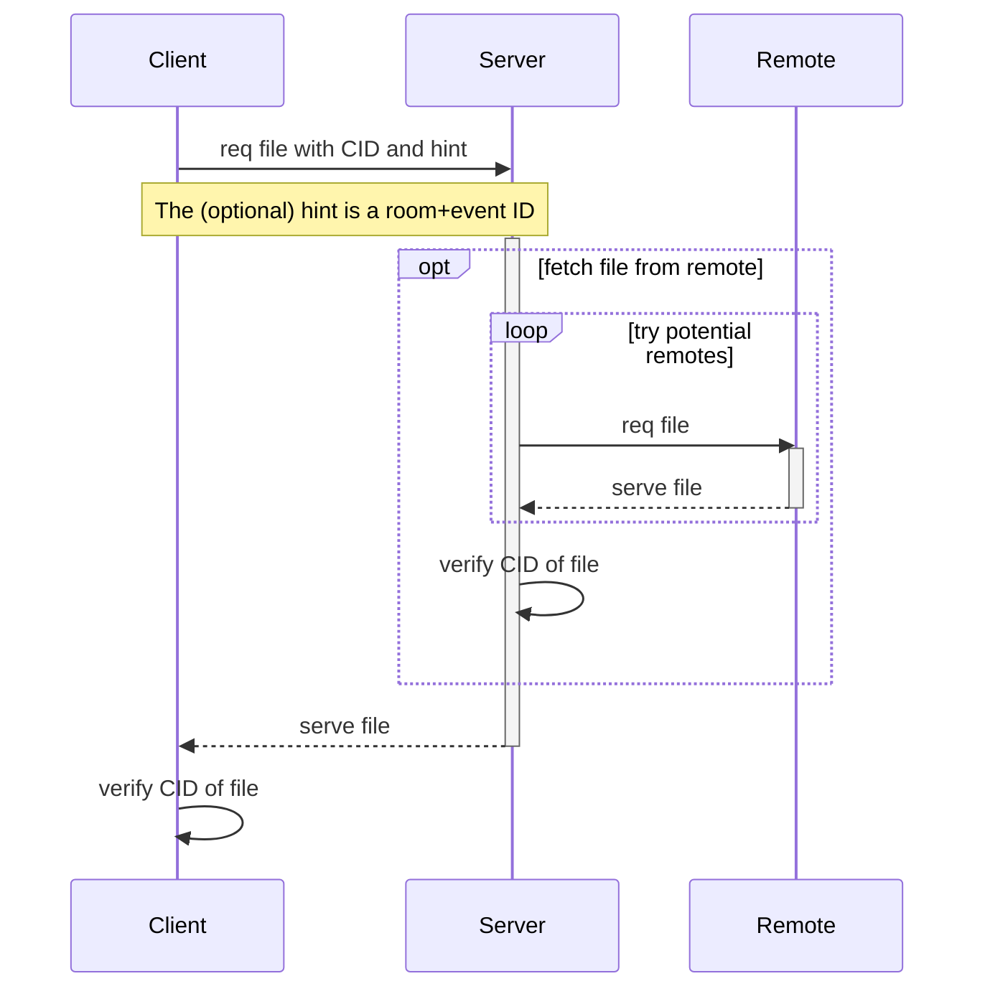

# MSCNaN: Decentralising Media through CIDs
Authored by Jan Christian Grünhage and Andrew Morgan

Currently, the media API is less decentralised than most other aspects of
matrix. When the homeserver which uploaded a piece of content goes down, the
content is not visible from homeservers who didn't fetch it before. This is
because the mxc URLs are made up of the server name of the sending server and
an opaque media ID. We can't fetch it from other servers than the origin
server because we there is no signature or hash included to verify the
integrity of the file. This proposal modifies the media ID to be a
[CID](https:/github.com/multiformats/cid) (content ID), which (among other
things) includes a hash of the file, so that we can verify the integrity of
the file, both on the server side and the client side. 

## Current Behaviour
### Sending

**TODO**: more details here
### Receiving

**TODO**: more details here
## Proposal
### Data structures
We propose `mxc` URLs to change from `mxc://<server>/<opaque ID>` to
`mxc://<server>/<CID>`. We include the the server here for backwards
compatibility reasons, so that old servers and clients would still work as
before, and also as a primary source for downloading the media. If that fails,
the server needs a hint where to get the media from instead, which the client
may send to the server as a query parameter.
### Sending

**TODO**: more details here
### Receiving

**TODO**: more details here
##### Potential remotes
For looking at potential remotes, the server first looks at the origin encoded
in the `mxc` URL. If that server is offline, and the client has supplied a
room+event ID combo or explicit fallback servers, try those. For an event, first
try server that were in the room when the event was sent and still are, then
ones that can see the event and are in the room right now, and if all those
fail, servers that were in the room back when the event was sent and aren't in
the room anymore. For fallback servers supplied by the client, try them in the
order the client put them into the query parameters.
## Potential Issues
**TODO**: more details here
## Alternatives/Related MSCs
1. **MSC2706** proposes to use IPFS directly, but in a similarily backwards
   compatible way to how we're changing `mxc` URLs here. MSC2706 does make
   authenticating media worse, because it publishes the file to IPFS and that is
   easy to scrape, but that also means that fallback nodes are automatically
   found.
   Public files in this MSC *could* be put into IPFS in the future, maybe as an
   updated version of MSC2706, without changing the `mxc` URL format again, as
   we'd already have CIDs here.
1. **MSC2703** specifies a grammer for media IDs, which could be problematic for
   us here. It specifies that media IDs must be opaque, as well as a maximum of
   255 characters in length. This is in conflict to this MSC (and also MSC2706),
   because we do encode information in the media ID, which servers and clients
   do want to decode. It contains a hash, which should be used to verify the
   integrity of the file that was fetched. The other possible conflict with that
   MSC is the character limit of 255 characters, which should not affect this
   MSC, because a CID is normally 60 characters, but that depends on what the
   CID actually looks like. In the future, a CID based on a much longer
   multihash could mean we run into issues here, but this is fairly unlikely, as
   that would mean hash lengths of over a thousand bits.
1. **MSCNaN** proposes authentication of media endpoints using events attached
   to the media files. As this MSC also does, it proposes sending the room and
   event ID as query parameters when downloading. It's authentication would also
   help with the potential issue of leaking file contents, as discussed in the
   security considerations section.
## Security considerations
 - Without authentication, this enables fetching of files you know the hash of
   (assuming the hash you know is one the media repo of your server supports).
   This is potentially problematic, as hashes of things are leaked in places
   where access to files are not always leaked as well. For example, git commit
   IDs are SHA1 hashes of the objects, so a commit ID could lead to the whole
   repo (up to that commit) being leaked when the objects end up in matrix's
   media repo. This is a fairly far fetched usecase, but it's still an indicator
   that this might be problematic. MSCNaN would help here.
## Backwards Compatibility Concerns
Clients/Servers not implementing this MSC should continue to work normally. New
events sent with non-CID media IDs should not pose a problem either, because
they wouldn't be parsed as CIDs successfully. If they actually are parsed as
CIDs successfully but aren't valid, that's either a huge coincidence, or, a lot
more likely, a malicious `mxc` URL. In that case, it would just fail, which is not
worse than what malicious `mxc` URLs can already do right now.
